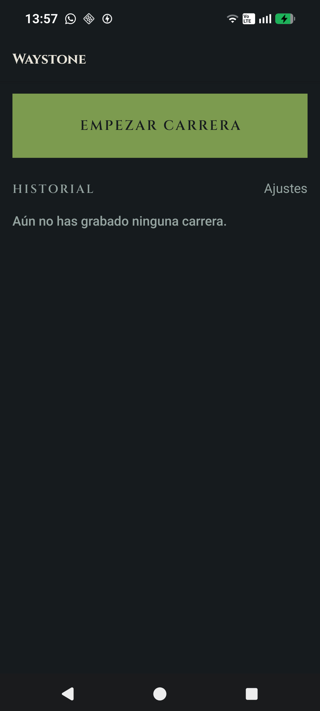
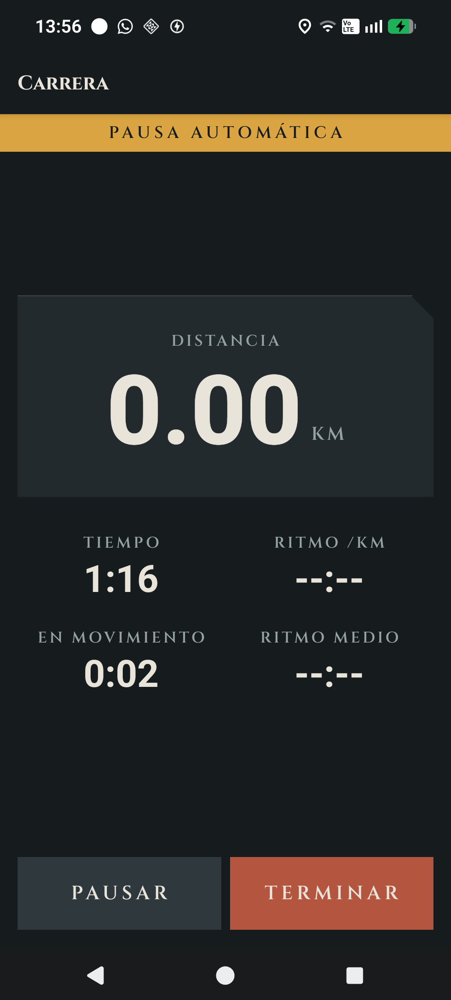
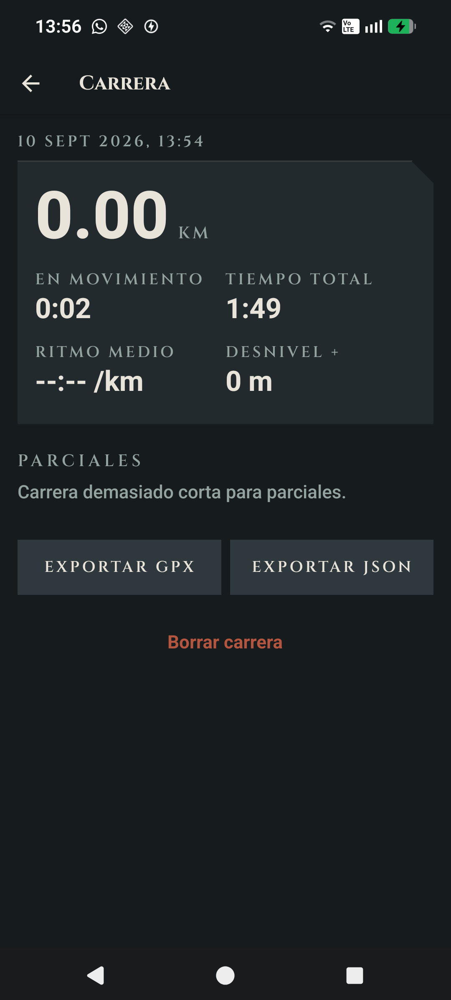

# Waystone

App de running para Android. Yo grabo, yo guardo, yo decido.

Un *waystone* es el mojón de piedra tallado al borde del camino que marca distancia
y dirección — literalmente lo que hace la app.

<p align="center">
  
  
  
</p>

## Por qué

Probé Strava y me molestaron dos cosas: lo útil está detrás de un muro de pago, y
los datos los gestiona otro. Waystone es la respuesta mínima a eso — graba la
carrera con GPS, la guarda **entera y en local**, y me deja exportarla cuando
quiera (JSON crudo o GPX estándar). Sin cuenta, sin servidor, sin sincronización.

No pretende competir con Strava. Es una app personal que hace exactamente lo que
necesito y nada más.

## La idea de arquitectura

**El rastro de puntos GPS es sagrado. Todo lo demás se recalcula.**

La capa de captura solo hace una cosa: `INSERT` de puntos crudos (`lat`, `lon`,
`ts`, `altitude`, `accuracy`, `speed`). Corre en un contexto frágil —la app puede
estar en background o incluso matada por el sistema— así que no calcula nada: si
algo peta ahí, se pierde la carrera.

Distancia, ritmo, splits, autopausa… todo se **deriva al leer**, con funciones
puras en [`src/core/`](src/core) (sin React, sin SQLite, ~100 tests). Los
agregados que se guardan en la tabla `runs` son una caché: se pueden borrar y
reconstruir sin haber perdido nada.

- La **autopausa** se deduce del stream de puntos con histéresis; no se persiste.
- Las **pausas manuales** sí son hechos: se guardan como eventos (`run_events`).
- Los **logros** ("runas") también son hechos: se escriben una vez en
  `achievements` y no se recalculan nunca, aunque la caché que los disparó cambie.
- El **desnivel** se calcula sobre la altitud del GPS, que sin corrección contra un
  modelo de elevación (DEM) sobreestima bastante en terreno llano. Se muestra con
  `≈` y es orientativo; distancia y ritmo, que van sobre la posición horizontal, sí
  son fiables.

## Stack

| | |
|---|---|
| **Expo SDK 57** · React Native 0.86 · TypeScript | build nativo con `expo run:android`, sin EAS |
| **expo-location** + **expo-task-manager** | GPS en background vía foreground service |
| **expo-sqlite** + **Drizzle** (API síncrona) | todo local, con runner de migraciones propio |
| **MapLibre RN** + **OpenFreeMap** | mapas sin API key |
| **Zustand** | estado efímero de sesión + ajustes |

El tema visual —piedra, musgo, ámbar, tipografía Cinzel para las inscripciones—
decora; los datos van en sans legible con `tabular-nums`. Las runas nunca informan.

## Correr el proyecto

Requiere el **Android SDK** con la variable `ANDROID_HOME` apuntando a él
(alternativa: crear `android/local.properties` con
`sdk.dir=C:/ruta/al/Sdk` — usar barras normales, no `\`).

```bash
npm install
npm run android          # compila e instala en un dispositivo/emulador conectado
```

Para un APK de release firmado con la debug keystore (suficiente para uso
personal):

```bash
cd android && ./gradlew app:assembleRelease
# app/build/outputs/apk/release/app-release.apk
```

`android/` está versionado (no se regenera con `expo prebuild`): lleva
`reactNativeArchitectures=arm64-v8a` en `gradle.properties`, sin lo cual el build
entra en un bucle de ninja/CMake en Windows.

## Verificación

```bash
npm run typecheck        # tsc --noEmit
npm run lint             # expo lint
npm test                 # jest — solo src/core y src/db (lógica pura)
```

`scripts/analyze-run.ts` (`npm run analyze -- carrera.json`) analiza un export
JSON fuera del dispositivo: puntos, huecos entre fixes, elapsed recalculado vs
caché. Reusa `src/core`, así que mide lo mismo que muestra la app.

## Licencia

MIT — ver [LICENSE](LICENSE).
